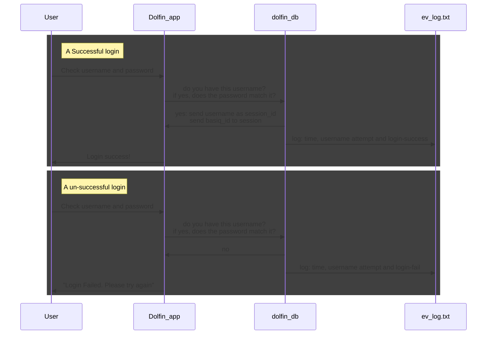

```mermaid
sequenceDiagram
    rect rgb(64,64,64)
    note right of User: A Successful login
        User->>Dolfin_app: Check username and password

        Dolfin_app->>dolfin_db: do you have this username?<br>if yes, does the password match it?

        dolfin_db->>Dolfin_app: yes: send username as session_id<br>send basiq_id to session
        
        dolfin_db->>ev_log.txt: log: time, username attempt and login-success

        Dolfin_app->>User: Login success!
    end

    rect rgb(64,64,64)
    note right of User: A un-successful login
        User->>Dolfin_app: Check username and password

        Dolfin_app->>dolfin_db: do you have this username?<br>if yes, does the password match it?

        dolfin_db->>Dolfin_app: no
        
        dolfin_db->>ev_log.txt: log: time, username attempt and login-fail

        Dolfin_app->>User: "Login Failed. Please try again"
    end
```
